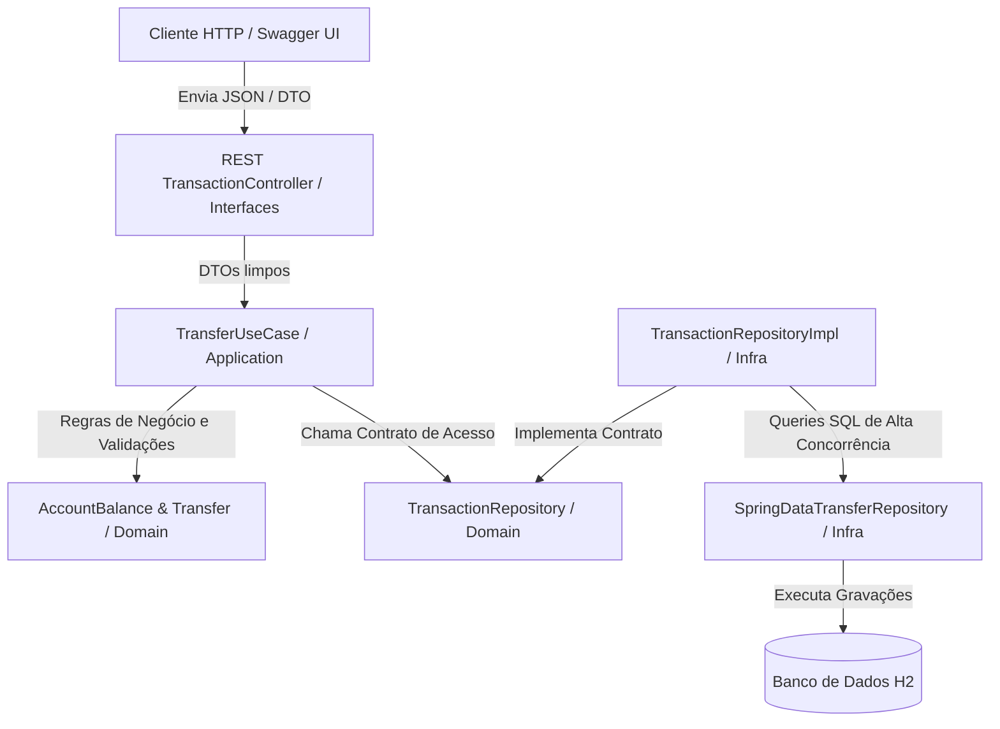
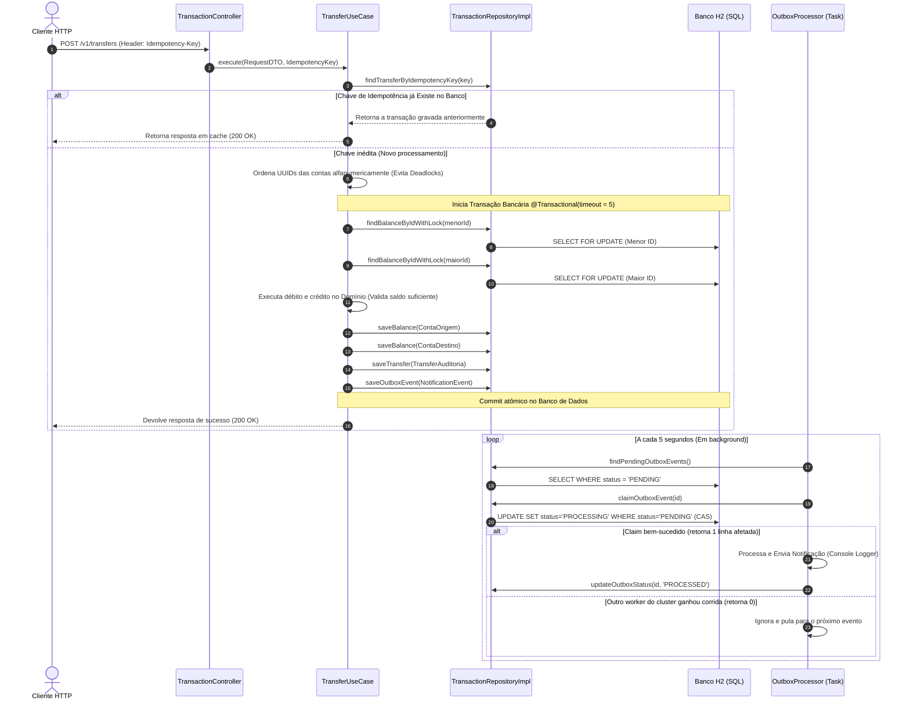

# Digital Banking Backend 🏦

[](https://www.oracle.com/java/)
[](https://spring.io/projects/spring-boot)
[-blue.svg)](https://www.h2database.com/)

API de serviços bancários resiliente, de alta performance e projetada para cenários de alta concorrência. O projeto foi estruturado seguindo os princípios de **Domain-Driven Design (DDD)** e **Arquitetura em Camadas (Layered Architecture)**, priorizando a integridade financeira absoluta e consistência transacional.

---

## 🚀 Como Rodar o Projeto

### Pré-requisitos
* **Java Development Kit (JDK) 17** ou superior.
* **Maven 3.6+** (opcional, o wrapper `./mvnw` está incluso no repositório).

### 1. Clonar e Compilar o Projeto
No terminal do seu sistema operacional, execute:
```bash
# Compilar o código e baixar as dependências
./mvnw clean compile
```

### 2. Rodar a Suíte de Testes
Para garantir que todas as validações estruturais, de negócio e concorrência distribuída estão corretas:
```bash
./mvnw test
```
*A suíte de testes inclui testes de concorrência real simulando transferências massivas cruzadas em paralelo.*

### 3. Iniciar a Aplicação
```bash
# Executar o Spring Boot
./mvnw spring-boot:run
```
O servidor iniciará na porta **`8080`**.

### 4. Acesso aos Utilitários
* **Swagger UI (Documentação Interativa):** Acesse [http://localhost:8080/swagger-ui.html](http://localhost:8080/swagger-ui.html) para visualizar e interagir com os endpoints expostos.
* **Console do Banco de Dados H2:** Acesse [http://localhost:8080/h2-console](http://localhost:8080/h2-console):
  * **JDBC URL:** `jdbc:h2:mem:mydb`
  * **User Name:** `sa`
  * **Password:** *(deixe em branco)*

## 📊 Exemplos de Teste com Dados Pré-existentes (Seed Data)

A aplicação inicializa automaticamente com massa de dados robusta pré-carregada para facilitar os testes de integração. Copie e cole os comandos abaixo de acordo com o seu terminal de preferência (Linux/macOS, PowerShell ou Command Prompt):

### 1. Efetuar uma Nova Transferência
Transfere R$ 100,00 da conta de **Gabriel Jesus** para a conta de **Jorge Jesus** usando uma chave de idempotência exclusiva:

#### Opção A: Linux / macOS (Bash / Zsh)
```bash
curl -X POST "http://localhost:8080/v1/transfers" \
  -H "accept: application/json" \
  -H "Idempotency-Key: a176d655-46aa-43e8-8b2b-36fb191cb140" \
  -H "Content-Type: application/json" \
  -d '{
    "sourceAccountId": "e7b3a1a1-2b3c-4d5e-6f7a-8b9c0d1e2f3a",
    "destinationAccountId": "a1b2c3d4-e5f6-7a8b-9c0d-1e2f3a4b5c6d",
    "amount": 100.0000
  }'
```

#### Opção B: Windows (PowerShell)
```powershell
Invoke-RestMethod -Uri "http://localhost:8080/v1/transfers" `
  -Method Post `
  -Headers @{ "Idempotency-Key" = "a176d655-46aa-43e8-8b2b-36fb191cb140"; "accept" = "application/json" } `
  -ContentType "application/json" `
  -Body '{"sourceAccountId":"e7b3a1a1-2b3c-4d5e-6f7a-8b9c0d1e2f3a","destinationAccountId":"a1b2c3d4-e5f6-7a8b-9c0d-1e2f3a4b5c6d","amount":100.0000}'
```

#### Opção C: Windows (Command Prompt / CMD)
```cmd
curl -X POST "http://localhost:8080/v1/transfers" -H "accept: application/json" -H "Idempotency-Key: a176d655-46aa-43e8-8b2b-36fb191cb140" -H "Content-Type: application/json" -d "{\"sourceAccountId\":\"e7b3a1a1-2b3c-4d5e-6f7a-8b9c0d1e2f3a\",\"destinationAccountId\":\"a1b2c3d4-e5f6-7a8b-9c0d-1e2f3a4b5c6d\",\"amount\":100.0000}"
```

---

### 2. Consultar Extrato por Período (Primeira Página)
Busca a primeira página (tamanho 10) das 300 transações pré-carregadas:

#### Opção A: Linux / macOS (Bash / Zsh)
```bash
curl -X GET "http://localhost:8080/v1/accounts/e7b3a1a1-2b3c-4d5e-6f7a-8b9c0d1e2f3a/statements/range?startDate=2026-06-01T00:00:00Z&endDate=2026-06-23T23:59:59Z&pageSize=10" \
  -H "accept: application/json"
```

#### Opção B: Windows (PowerShell)
```powershell
Invoke-RestMethod -Uri "http://localhost:8080/v1/accounts/e7b3a1a1-2b3c-4d5e-6f7a-8b9c0d1e2f3a/statements/range?startDate=2026-06-01T00:00:00Z&endDate=2026-06-23T23:59:59Z&pageSize=10" -Method Get
```

#### Opção C: Windows (Command Prompt / CMD)
```cmd
curl -X GET "http://localhost:8080/v1/accounts/e7b3a1a1-2b3c-4d5e-6f7a-8b9c0d1e2f3a/statements/range?startDate=2026-06-01T00:00:00Z&endDate=2026-06-23T23:59:59Z&pageSize=10" -H "accept: application/json"
```

*A resposta retornará um JSON contendo a propriedade `paging.nextCursor`. Copie esse token Base64 e envie no parâmetro `&cursor=...` para buscar a página subsequente.*

---

### 3. Gerar Extrato PDF Anual
Efetua o download do extrato consolidado em PDF de todas as movimentações ocorridas durante o ano de 2026:

#### Opção A: Linux / macOS (Bash / Zsh)
```bash
curl -X GET "http://localhost:8080/v1/accounts/e7b3a1a1-2b3c-4d5e-6f7a-8b9c0d1e2f3a/statements/year?year=2026" \
  -H "accept: application/pdf" \
  --output extrato_gabriel_2026.pdf
```

#### Opção B: Windows (PowerShell)
```powershell
Invoke-WebRequest -Uri "http://localhost:8080/v1/accounts/e7b3a1a1-2b3c-4d5e-6f7a-8b9c0d1e2f3a/statements/year?year=2026" -OutFile "extrato_gabriel_2026.pdf"
```

#### Opção C: Windows (Command Prompt / CMD)
```cmd
curl -X GET "http://localhost:8080/v1/accounts/e7b3a1a1-2b3c-4d5e-6f7a-8b9c0d1e2f3a/statements/year?year=2026" -H "accept: application/pdf" -o extrato_gabriel_2026.pdf
```

---

## 🏗️ Comunicação das Camadas e Fluxo do Sistema

### 1. Comunicação das Camadas (DDD Layering)

O diagrama abaixo ilustra o fluxo de dependências. As camadas externas conhecem as interfaces declaradas nas camadas internas, respeitando a Inversão de Dependências:



### 2. Fluxo Executivo da Transação e Resiliência (Sequence Diagram)

O diagrama abaixo detalha a sequência executiva completa de uma transferência concorrente com controle de idempotência, travamento de concorrência pessimista em banco, commit único de dados e consumo assíncrono via Transactional Outbox:



---

## 🛠️ Detalhamento das Decisões de Design e Alta Concorrência

Para garantir estabilidade, segurança e consistência em nível de "grande banco", os seguintes padrões de engenharia foram implementados:

### 1. Seleção de Lock: Por que Pessimista (`SELECT FOR UPDATE`)?
Em sistemas financeiros, a consistência e a integridade de saldo são críticas e é possível escolher entre ter ou não a consistência dos dados. Analisamos os dois modelos de concorrência:
* **Lock Otimista (Versionamento/CAS):** Seria ineficiente para saldos bancários devido ao alto volume de colisões de escrita (ex: uma conta recebendo ou efetuando múltiplos pagamentos ao mesmo tempo). Com lock otimista, a transação que perdesse a corrida sofreria *rollback*, exigindo lógicas complexas de retentativa e degradando o *throughput* (vazão) global do sistema.
* **Lock Pessimista (Lock de Banco):** Bloqueia a linha da conta no banco de dados. Transações simultâneas na mesma conta entram em uma fila ordenada de espera atômica. Embora introduza um tempo mínimo de espera, garante que a leitura e a escrita do saldo sejam feitas com consistência absoluta, eliminando totalmente o risco de **gasto duplo (double-spending)**.

### 2. Prevenção de Deadlock via Ordenação Dinâmica
Na transferência envolvendo duas contas (Origem A e Destino B), locks pessimistas concorrentes cruzados (A transferindo para B e B transferindo para A no mesmo instante) podem causar **deadlock** (travamento cíclico infinito). 
* **Regra Executiva:** Para impedir essa condição, o UUID das duas contas envolvidas é comparado e ordenado alfanumericamente. O lock pessimista (`SELECT FOR UPDATE`) é adquirido **sempre na conta com o menor ID primeiro** e depois na conta com maior ID. Isso garante a linearidade da fila de execução no banco, tornando a ocorrência de deadlocks matematicamente impossível.
* **Timeout de Segurança:** A conexão possui timeout estrito de **2 segundos** (`LOCK_TIMEOUT=2000`). Se a concorrência travar a fila além desse tempo, a transação falha rápido devolvendo status HTTP **`423 Locked`** (`BANK-004`).

### 3. Sintonização de Pools de Recursos (Tomcat & HikariCP)
Para suportar enxurradas concorrentes de requisições sem causar travamento de threads da JVM:
* **HikariCP Pool (Persistência):** Configurado com pool máximo de **50 conexões** (`DB_POOL_MAX: 50`) e timeout de conexão baixo de **2 segundos**.
* **Tomcat Thread Pool (Web):** Limitado a **200 threads**.
* **Alinhamento:** Como o timeout de lock pessimista e de conexão no pool são de 2 segundos, garantimos que conexões travadas sejam abortadas rapidamente. Isso impede a ocorrência de **Thread Starvation** (esgotamento de threads do Tomcat aguardando conexões lentas), mantendo o servidor web responsivo mesmo sob alto estresse.

### 4. Transactional Outbox Pattern & Notificação
Garante entrega confiável de mensagens (*At-Least-Once*) a sistemas externos de forma assíncrona:
* **Escrita Atômica:** O evento de notificação é persistido na tabela `notification_outbox` dentro do mesmo bloco `@Transactional` e na **mesma transação física de banco de dados** que realiza o débito e o crédito dos saldos. Se a transferência falhar, o evento sofre rollback; se persistir, a gravação do evento é garantida.
* **Worker Assíncrono com Exclusão Mútua (Compare-And-Swap):** O worker do processador de outbox roda de forma recorrente em background. Para evitar que múltiplas instâncias rodando em cluster processem e disparem a mesma notificação duplicada, ele realiza um *claim* atômico atualizando o status do registro:
  `UPDATE notification_outbox SET status = 'PROCESSING' WHERE id = :id AND status = 'PENDING'`
  Se a linha foi alterada por outro nó, a query retorna 0 e o nó atual ignora o registro, evitando duplicações.
* **Simulação de Notificação (Console Logger):** O disparo final da notificação é efetuado escrevendo logs estruturados no console da aplicação. Essa escolha simula perfeitamente um cenário real de produção onde uma ferramenta de mensageria (Kafka/RabbitMQ) ou outro microsserviço dedicado leria de forma independente os eventos persistidos no banco para processar disparos externos (e-mail, push, webhooks), dissociando a transação financeira direta da comunicação.

### 5. Paginação por Cursor (Keyset Pagination)
A listagem de transações por período (`/statements/range`) adota paginação por cursor ao invés de paginação clássica por offset (`LIMIT/OFFSET`):
* **Desempenho Estável:** A query salta direto para a posição do cursor na árvore do índice composto em tempo de complexidade e lê apenas o limite solicitado, mantendo tempos de resposta idênticos e sub-milissegundos seja na página 1 ou na página 10.000.
* **Consistência do Feed:** Novas inserções de transferências que ocorrem enquanto o usuário navega não causam deslocamentos de linhas. O usuário nunca visualiza registros duplicados ou omissões ao passar de página.
* **Índices Compostos sob Medida:** Criado dois índices físicos para evitar que o banco de dados realize ordenação temporária em disco:
  * `idx_transfer_source_paged` `(source_account_id, created_at DESC, id DESC)`
  * `idx_transfer_dest_paged` `(destination_account_id, created_at DESC, id DESC)`

### 6. Controle Rígido de Idempotência
Para mitigar falhas de rede que fazem o cliente reenviar a mesma transferência:
* O cabeçalho HTTP obrigatório `Idempotency-Key` (UUID v4) é armazenado junto à transação no banco.
* Se a requisição for repetida com a mesma chave:
  * **Parâmetros Idênticos:** Retorna imediatamente a resposta correspondente gravada em cache/banco com status `200 OK`, sem reprocessar saldos.
  * **Parâmetros Divergentes (Fraude/Mutação):** Bloqueia a execução imediatamente com `400 Bad Request` (`BANK-001`), evitando que uma chave seja reaproveitada para roubar dados de outra transferência.

### 7. Modelagem Física do Schema e Controle de Fluxo por Colunas
A estruturação física de colunas e constraints no banco foi pensada especificamente para o controle rígido do fluxo da aplicação:
* **`idempotency_key VARCHAR(36) UNIQUE`:** A constraint de unicidade a nível de banco de dados funciona como barreira final física intransponível contra transferências duplicadas concorrentes.
* **`amount DECIMAL(18, 4)`:** O tipo `DECIMAL` previne qualquer perda de precisão de ponto flutuante. A precisão de 4 casas decimais permite controle exato até frações centesimais (comuns em transações bancárias e de câmbio).
* **`status VARCHAR(20)` (`notification_outbox`):** Controla a máquina de estados do Worker assíncrono (`PENDING` -> `PROCESSING` -> `PROCESSED` ou `DLQ`).
* **`retry_count INT DEFAULT 0`:** Controla a governança de retentativas para evitar loops de processamento infinitos em caso de instabilidades.

### 8. Validação Defensiva de Entrada (Fail-Fast)
O sistema aplica validação defensiva rigorosa em todas as pontas de entrada:
* **Validação Sintática no Payload (Records):** Uso de constraints estruturais nos DTOs que validam a integridade dos dados no exato momento da desserialização do JSON (ex: valores nulos, formatos UUID malformados, limites numéricos físicos).
* **Validação Semântica nos Casos de Uso:** O sistema intercepta e rejeita imediatamente dados inconsistentes antes de iniciar transações de banco (ex: datas inválidas, períodos superiores a 90 dias, e precisão monetária superior a 4 casas decimais).
* **Benefício:** Evita consumo inútil de recursos de transação, conexões de pool e CPU no banco para requisições sabidamente errôneas ou maliciosas.

### 9. Catálogo Geral de Respostas HTTP da Aplicação
Toda a comunicação externa da API é regida por respostas semânticas padronizadas baseadas em status HTTP e códigos específicos de negócio:
* **`200 OK` / `201 Created`**: Operação realizada com sucesso absoluto.
* **`400 Bad Request`** (Código `BANK-001`): Erros sintáticos, payloads estruturalmente incorretos, UUIDs ou datas malformatadas, ou chave de idempotência reutilizada com dados divergentes.
* **`404 Not Found`** (Código `BANK-003`): Recurso físico (como a conta informada na transferência) não existe no banco de dados.
* **`405 Method Not Allowed`** (Código `BANK-005`): Uso de verbo HTTP incorreto para o endpoint consultado.
* **`422 Unprocessable Entity`** (Código `BANK-002`): Violações diretas de regras de negócio de domínio (ex: saldo insuficiente, autotransferência, limite diário de R$ 5.000,00 excedido, ou intervalo de datas maior que 90 dias).
* **`423 Locked`** (Código `BANK-004`): Requisição abortada devido ao estouro de limite de tempo (timeout de 2 segundos) aguardando liberação do lock da conta.
* **`500 Internal Server Error`** (Código `BANK-999`): Erro sistêmico inesperado. Mascarado para omitir detalhes técnicos sensíveis e logs internos de stack trace do cliente final.

---

## 📂 Índice de Especificações e Documentos Técnicos (`/docs`)

Para um entendimento profundo das especificações técnicas, diagramas de fluxo e regras executivas que regem este projeto, consulte a pasta de documentação técnica:

### 📐 Arquitetura e Contratos de Erro:
* [Guia de Estrutura DDD e Dependências](https://github.com/gabrielSdejesus/digital-banking/blob/main/docs/architecture/v1_architecture.md): Detalhamento teórico das camadas e responsabilidades de cada pacote.
* [Diretrizes de OpenAPI e Maturidade da API REST](https://github.com/gabrielSdejesus/digital-banking/blob/main/docs/architecture/v1_doc.md): Regras de exposição Swagger e mapeamento OpenAPI.
* [Especificação Global de Tratamento de Erros](https://github.com/gabrielSdejesus/digital-banking/blob/main/docs/architecture/v1_error-spec.md): Catálogo completo das respostas JSON do `GlobalExceptionHandler` e códigos de erros de negócio (`BANK-xxx`).

### 🎯 Casos de Uso e Regras de Negócio:
* [Especificação Técnica de Contas](https://github.com/gabrielSdejesus/digital-banking/blob/main/docs/business/v1_account-spec.md): Regras de criação de contas, validações sintáticas de nomes e limites numéricos.
* [Especificação Técnica de Outbox e Worker](https://github.com/gabrielSdejesus/digital-banking/blob/main/docs/business/v1_outbox-spec.md): Mecanismos de claim do outbox, lógica de retentativas do worker e descarte na fila Dead Letter Queue.
* [Especificação Técnica de Transferências e Paginação por Cursor](https://github.com/gabrielSdejesus/digital-banking/blob/main/docs/business/v1_transaction-spec.md): Detalhamento do algoritmo de lock pessimista, tie-breaker de cursor Base64 e regras de limite de transferência diária.

### 🧪 Suite de Testes:
* [Documentação Geral da Suite de Testes](https://github.com/gabrielSdejesus/digital-banking/blob/main/docs/business/test-doc.md): Mapeamento de 100% dos testes unitários, testes de integração de banco de dados e testes de stress de concorrência concorrentes do projeto.